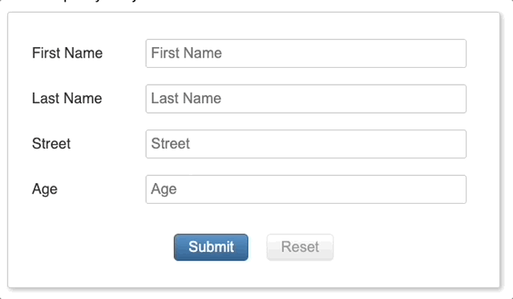

### Objective: 
Most forms show required error messages when the user moves out of a required field or submits the form.  The right time to show errors when a user **skips** a required field.  A field is **skipped** whenever any control below the required field is used.  

### Example:
The user's only interaction is clicking the 3rd field, the first two fields should display the "Required" error messages. 